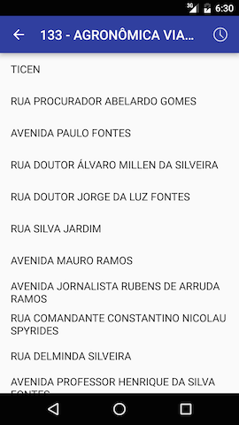

# Easy Bus

> Click [here](http://bit.ly/24YHUQi) to download the APK

Easy Bus is your companion when you're totally lost in Florianópolis and want to know what buses can take you home. Or if you just want to find information about the city's public transportation. It searches routes by street names, and for each route it presents the complete itinerary and the schedule.

## Screenshots 

  
  
  

## Design Considerations:

- This app’s minimum SDK version is 15, supporting 97.3% of the devices out there (according to [this](http://developer.android.com/intl/pt-br/about/dashboards/index.html)).
- The latest versions of Android SDK, Android Support Library, and Google Play Services were used.
- It was given preference to the support library variant of the components (e.g. `android.support.v4.app.Fragment` and `android.support.v4.app.LoaderManager`).
- Orientation change is supported by all activities (and fragments).
- Not much effort was taken to make the app look pretty. The main concern was to make it simple and clean.
- The app was mainly tested on an LGE LG-P875h running Android 4.1.2 and on a Nexus 5 emulator running Android 6.0.
